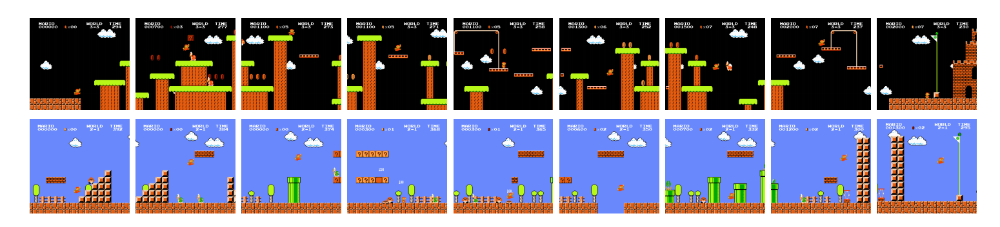
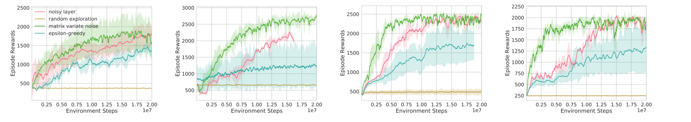

## Structural Parameter Space Exploration for Reinforcement Learning via a Matrix Variate Distribution

PyTorch implementation of paper "Structural Parameter Space Exploration for
Reinforcement Learning via a Matrix Variate
Distribution"

The code is coming.
## Visualization of the environments

 
# Performance on Super Mario Bros tasks

 
